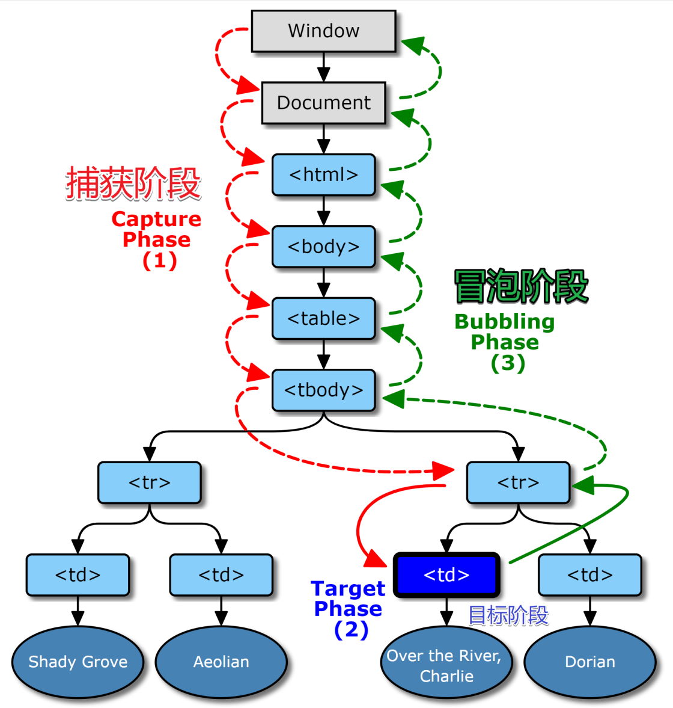

# DOM 事件

## DOM 事件级别

DOM 级别一共可以分为四个级别：DOM 0 级、DOM 1 级、DOM 2 级和 DOM 3 级。而 DOM 事件分为 3 个级别：DOM 0 级事件处理，DOM 2 级事件处理和DOM 3 级事件处理。由于 DOM 1 级中没有事件的相关内容，所以没有DOM 1 级事件。

### DOM 0 级事件
DOM 0 级事件即事件处理程序，它将一个函数赋值给一个事件处理属性，例如：
````JavaScript
const btn = document.querySelector('button');

btn.onclick = function() {
  const rndCol = 'rgb(' + random(255) + ',' + random(255) + ',' + random(255) + ')';
  document.body.style.backgroundColor = rndCol;
}
````
这里直接将 ````onclick```` 作为 ````button```` 的属性，对它进行赋值。
它的缺点在于一个处理程序（事件）无法同时绑定多个处理函数，因为后赋的值总是会覆盖前面的值。

### DOM 2 级事件
DOM 2 级事件即 Document Object Model (DOM) Level 2 Events, 是我们应该重点关注和学习的机制，它是在 DOM 0 级事件的基础上添加了两个函数： ````addEventListener()```` 和 ````removeEventListener()````, 使得 DOM 2 级事件 可以随意添加多个处理函数。例如：
````JavaScript
myElement.addEventListener('click', functionA);
myElement.addEventListener('click', functionB);
myElement.removeEventListener('click', functionB);
myElement.addEventListener('click', functionC);
````

### DOM 3 级事件
DOM3级事件在DOM2级事件的基础上添加了更多的事件类型，详细部分省略，同时DOM3级事件也允许使用者自定义一些事件。

## DOM 事件模型

DOM 事件模型分为捕获和冒泡。事件从window对象自上而下向目标节点传播的阶段叫做捕获，事件从目标节点自下而上向window对象传播的阶段叫做冒泡。如图所示：



在事件处理时，首先进入捕获阶段，再进入冒泡阶段。捕获阶段不可取消，但冒泡阶段可以取消，通过 ````e.stopPropagation()```` （ e 为事件对象）可以实现。

在 DOM 2 级事件中，默认函数进入冒泡阶段，要实现事件捕获，需要将 addEventListener() 的第三个参数改为 true.

## DOM 事件委托

由于事件会在冒泡阶段向上传播到父节点，因此可以把子节点的监听函数定义在父节点上，由父节点的监听函数统一处理多个子元素的事件，这个过程就叫做事件委托。

它适用于以下两个场景：
1. 存在大量的子节点，需要在点击子节点的时候响应一个事件，如果给全部子节点都绑定函数，将非常消耗内存。我们只需要给父容器绑定方法，这样不管点击的是哪一个后代元素，都会根据冒泡传播的传递机制，把容器的 click 行为触发，然后把对应的方法执行，根据事件源，我们可以知道点击的是谁，从而完成不同的事。
[示例](http://js.jirengu.com/fulih/3/edit)

2. 在很多时候，我们需要通过用户操作动态的增删元素，如果监听的元素不存在，我们可以使用事件委托，非常方便的应付这种情况。
[示例](http://js.jirengu.com/ravod/5/edit?html,js,output)

## 参考文献
[DOM事件机制](https://juejin.cn/post/6844903731079675917#heading-8)
[MDN](https://developer.mozilla.org/zh-CN/docs/Learn/JavaScript/Building_blocks/Events)